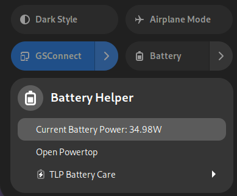
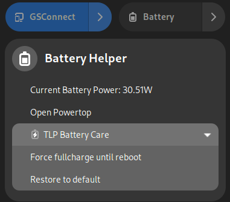
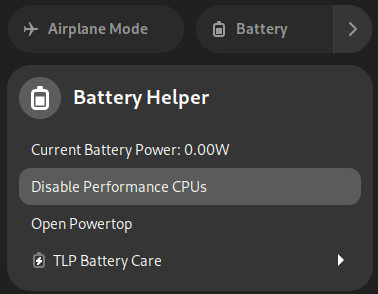

# gnome-shell-extension-battery-helper

Currently supports GNOME 45.

## Requirements

1. `gtk-launch`, `tlp` and `powertop` available.
2. `PowerTOP.desktop` copied to `~/.local/share/applications/`.
3. `pcpuonline.sh` copied to somewhere in `$PATH`.
4. Allow NOPASSWD sudo for `tlp fullcharge`, `tlp setcharge` and `pcpuonline.sh`.

Optional:

1. Allow NOPASSWD sudo for `powertop`, and modify `pkexec` to `sudo` in `PowerTOP.desktop`.
2. By default, `pcpuonline.sh` controls CPU1-7. Modify it to fit your needs (CPU0 cannot be offline).

## Limitation

1. The current battery power will not be automatically updated when the menu is kept open.
2. Supports one battery only.

